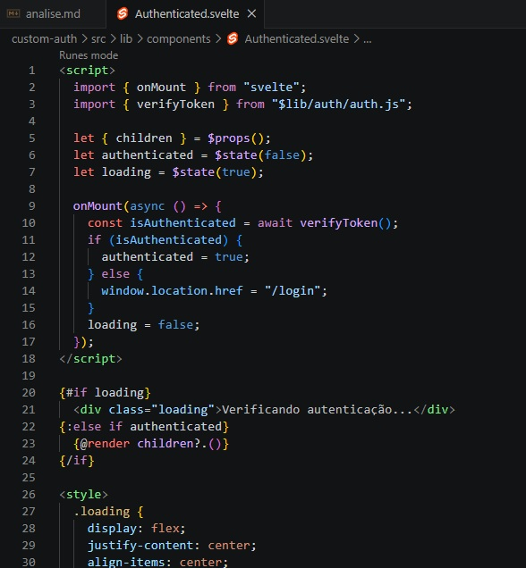
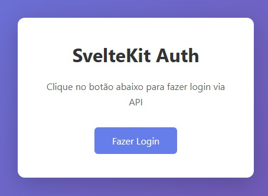
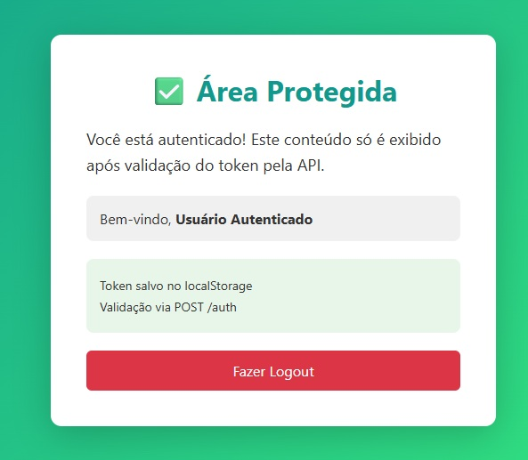
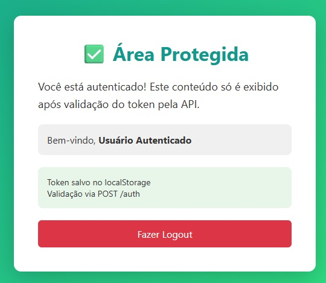
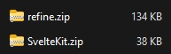

# Analise de abordagens para autenticação em Front-End 

Criei uma API utilizando nodeJs + Express que salva tokens, cria um tempo de expiração (30 segundos) e após esse tempo deleta os tokens. 
 
Ambas aplicações implementam os endpoints GET /token que solicita um token e POST /auth que verifica se um token é valido para dar acesso a uma pagina protegida.
 
## Tamanho das aplicações e códigos

As aplicações possuem um auth provider que consome estes endpoints. 
Aplicação custom com 45 linhas: 
 
```JS
async function login() {
  try {
    const res = await fetch("http://127.0.0.1:3001/token", {
      method: "GET"
    });
    const data = await res.json();
    console.log(data);
    localStorage.setItem("token", data.token);
    return data;
  } catch (error) {
    console.error("Erro ao fazer login:", error);
    throw error;
  }
}

async function verifyToken() {
  try {
    const token = localStorage.getItem("token");

    if (!token) {
      return false;
    }

    const res = await fetch("http://127.0.0.1:3001/auth", {
      method: "POST",
      headers: {
        "Content-Type": "application/json"
      },
      body: JSON.stringify({ token })
    });

    if (res.status === 200) {
      return true;
    } else if (res.status === 401) {
      return false;
    }

    return false;
  } catch (error) {
    console.error("Erro ao verificar token:", error);
    return false;
  }
}

export { login, verifyToken };
```
 
AuthProvider no padrão refine com 100 linhas: 
 
```JS
const API_URL = "http://127.0.0.1:3001";

export const authProvider = {
  // Faz login chamando a API /token
  login: async () => {
    try {
      const response = await fetch(`${API_URL}/token`, {
        method: "GET",
      });

      if (response.status === 200) {
        const data = await response.json();
        localStorage.setItem("token", data.token);
        return {
          success: true,
          redirectTo: "/",
        };
      }

      return {
        success: false,
        error: {
          name: "LoginError",
          message: "Erro ao fazer login",
        },
      };
    } catch (error) {
      return {
        success: false,
        error: {
          name: "LoginError",
          message: error.message,
        },
      };
    }
  },

  // Remove o token do localStorage
  logout: async () => {
    localStorage.removeItem("token");
    return {
      success: true,
      redirectTo: "/login",
    };
  },

  // Verifica se o usuário está autenticado chamando /auth
  check: async () => {
    try {
      const token = localStorage.getItem("token");

      if (!token) {
        return {
          authenticated: false,
          redirectTo: "/login",
        };
      }

      const response = await fetch(`${API_URL}/auth`, {
        method: "POST",
        headers: {
          "Content-Type": "application/json",
        },
        body: JSON.stringify({ token }),
      });

      if (response.status === 200) {
        return {
          authenticated: true,
        };
      }

      localStorage.removeItem("token");
      return {
        authenticated: false,
        redirectTo: "/login",
      };
    } catch (error) {
      return {
        authenticated: false,
        redirectTo: "/login",
      };
    }
  },

  // Retorna erros de autenticação
  onError: async (error) => {
    if (error.status === 401) {
      return {
        logout: true,
        redirectTo: "/login",
      };
    }

    return {};
  },

  // Obtém informações do usuário (opcional)
  getIdentity: async () => {
    const token = localStorage.getItem("token");

    if (token) {
      return {
        id: 1,
        name: "Usuário Autenticado",
      };
    }

    return null;
  },
};

```
 
O refine possui um componente Authenticated por padrão na biblioteca. 
A lógica de um componente com este comportamento foi feita no projeto customizado: 



Página para autenticação customizada:

```JS
<script>
  import { login } from "$lib/auth/auth.js";

  let isLoading = $state(false);

  async function handleLogin() {
    isLoading = true;
    try {
      await login();
      window.location.href = "/protected";
    } catch (error) {
      console.error("Erro no login:", error);
    } finally {
      isLoading = false;
    }
  }
</script>

<div class="container">
  <div class="card">
    <h1 class="title">SvelteKit Auth</h1>
    <p class="description">Clique no botão abaixo para fazer login via API</p>
    <button onclick={handleLogin} disabled={isLoading} class="button">
      {isLoading ? "Carregando..." : "Fazer Login"}
    </button>
  </div>
</div>
```



Página para Authenticação Refine:

```JS
import { useLogin } from "@refinedev/core";

  export const LoginPage = () => {
    const { mutate: login, isLoading } = useLogin();

    const handleLogin = () => {
      login({});
    };

    return (
      <div style={styles.container}>
        <div style={styles.card}>
          <h1 style={styles.title}>Refine Auth</h1>
          <p style={styles.description}>
            Clique no botão abaixo para fazer login via API
          </p>
          <button
            onClick={handleLogin}
            disabled={isLoading}
            style={styles.button}
          >
            {isLoading ? "Carregando..." : "Fazer Login"}
          </button>
        </div>
      </div>
    );
  };
```


## Código da area protegida por login

Custom:

```JS
<script>
  import Authenticated from "$lib/components/Authenticated.svelte";

  function handleLogout() {
    localStorage.removeItem("token");
    window.location.href = "/login";
  }
</script>

<Authenticated>
  <div class="container">
    <div class="card">
      <h1 class="title">✅ Área Protegida</h1>
      <div class="content">
        <p class="text">
          Você está autenticado! Este conteúdo só é exibido após validação do
          token pela API.
        </p>

        <div class="identity">
          <p>
            Bem-vindo, <strong>Usuário Autenticado</strong>
          </p>
        </div>

        <div class="info">
          <p>Token salvo no localStorage</p>
          <p>Validação via POST /auth</p>
        </div>

        <button onclick={handleLogout} class="button"> Fazer Logout </button>
      </div>
    </div>
  </div>
</Authenticated>
```




----------

Refine:

```JS
import { useLogout, useGetIdentity } from "@refinedev/core";

export const ProtectedPage = () => {
  const { mutate: logout } = useLogout();
  const { data: identity } = useGetIdentity();

  const handleLogout = () => {
    logout();
  };

  return (
    <div style={styles.container}>
      <div style={styles.card}>
        <h1 style={styles.title}>✅ Área Protegida</h1>
        <div style={styles.content}>
          <p style={styles.text}>
            Você está autenticado! Este conteúdo só é exibido após validação do token pela API.
          </p>
          {identity && (
            <p style={styles.identity}>
              Bem-vindo, <strong>{identity.name}</strong>
            </p>
          )}
          <div style={styles.info}>
            <p>Token salvo no localStorage</p>
            <p>Validação via POST /auth</p>
          </div>
          <button onClick={handleLogout} style={styles.button}>
            Fazer Logout
          </button>
        </div>
      </div>
    </div>
  );
};
```


## Bundles estáticos

Na dinabox sempre utilizamos builds estáticos para o front-end, então fiz o build estático de ambas aplicações para comparar o tamanho dos bundles:



Sveltekit:  38KB
refine:     134KB

Refine apresentou um bundle 3.5X maior.

# Análise do copilot

Também utilizei o copilot que tem acesso a todos os arquivos de ambos projetos para fazer uma analise de qual abordagem é mais favorável para a nossa utilização:

Para este exemplo de autenticação, a abordagem **custom-auth (SvelteKit)** é mais adequada. Aqui está o porquê:

## 🎯 Comparação

### **Custom-Auth (SvelteKit)** ✅ Melhor para este caso

**Prós:**
- **Mais leve** - Apenas Svelte, sem dependências extras de frameworks
- **Mais direto** - Você controla 100% da lógica
- **Menos código** - ~50 linhas de auth.js vs toda estrutura do Refine
- **Mais rápido** - Bundle menor, carregamento instantâneo
- **Mais simples de entender** - Sem abstrações, apenas fetch + localStorage

**Contras:**
- Você precisa escrever tudo manualmente
- Sem ferramentas prontas para CRUD/routing avançado

### **Refine (React)** ⚠️ Overhead desnecessário aqui

**Prós:**
- **Escalável** - Se você precisar adicionar CRUD, dashboards, etc
- **Convenções** - Estrutura padronizada para apps grandes
- **Ecossistema** - Muitos providers e integrações prontas

**Contras:**
- **Overkill** - Para só login/logout é como usar um canhão pra matar uma mosca
- **Mais pesado** - React + Refine + Router = ~200KB+ de dependências
- **Mais complexo** - AuthProvider, Resources, Router integration para algo simples
- **Curva de aprendizado** - Precisa entender conceitos do Refine

## 📊 Veredicto

```
Caso de uso: Login → Validar Token → Logout
Melhor escolha: Custom-Auth (SvelteKit)

Se fosse: CRUD completo + Auth + Dashboard
Melhor escolha: Refine
```

**O Refine brilha** quando você tem muitos recursos (usuários, produtos, pedidos) e precisa de interfaces de CRUD completas. Para apenas autenticação básica, é complexidade desnecessária.

**Recomendação:** Use o custom-auth e só migre para Refine se o projeto crescer significativamente! 🚀


# Conclusão
Como nossas páginas usam um tokem JWT do worpress não vamos tirar proveito dos conectores prontos do refine pois eles são para autenticações com google, amazon, OAuth 2.0, etc...

A implementação precisa ser customizada e isto resulta no mesmo trabalho do que fazer do zero.

A dificuldade de implementar ambas as soluções foi parecida, com o diferencial de precisar estudar a documentação do refine para entender como a estrutura funciona.